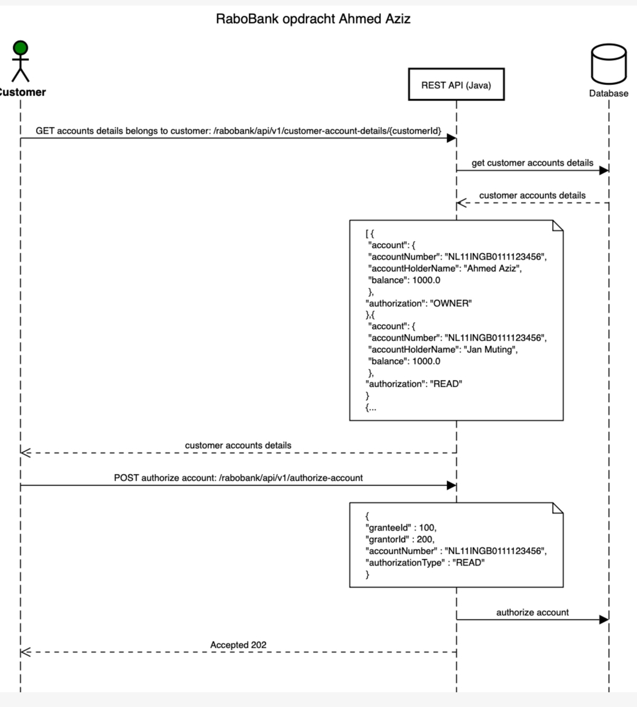

# Mancala Game

Rabobank assignment Ahmed Aziz

## Tech Stack

**Server:** Java 11, Spring boot, Spring WEB, Lombok, JPA, MongoDB

## Run Locally

Clone the project
```bash
  git clone https://github.com/ahmeed83/RabobankAssignment
```
Go to the project directory
```bash
  cd RabobankAssignment
```
Build the application
```bash
  mvn clean package
```
Start the server
```bash
  mvn spring-boot:run
```
Application will start on
[localhost:8080](http://localhost:8080)

## API Reference

| Rest Method | EndPoint                                                            | Description                       |
| :-------    | :--------                                                           | :--------------                   |
| `GET`       | `/rabobank/api/v1/customer-account-details/{customerId}`            | Get all customer accounts         |
| `POST  `    | `/rabobank/api/v1/authorize-account`                                | Authorize given account           |

## Sequence Diagrams


## Features
1- Customers can call the server with their user ID. They will get a list of their account details. These accounts consist of the account itself and the authorization type that this account has. 

2- The authorization type can consist of three types: 1) OWNER: which means this account belongs to the customer. 2) READ: This means this account does not belong to the customer but the customer has the right to see it. 3) Write: This means this account does not belong to the customer but the customer has the right to edit it. 

3- Customer can give authorize his accounts to other customers. The customer can permit READ/WRITE permissions of his accounts to others. The customer can not permit OWNER permission to other customers.

4- If the account is already assigned to a customer, this account can not be assigned one more time. The same account can be assigned to different customers if the authorization type is different. For example, if the customer has authorization for an account with type READ, the account can be authorized again for a different authorization type (in this case WRITE permisson). 

## Postman collection


## Author: Ahmed Aziz
- [Linkedin](https://www.linkedin.com/in/ahmedaziz83/)
- [GitHub](https://github.com/ahmeed83/)
- [Twitter](https://twitter.com/AA_ziz/)
